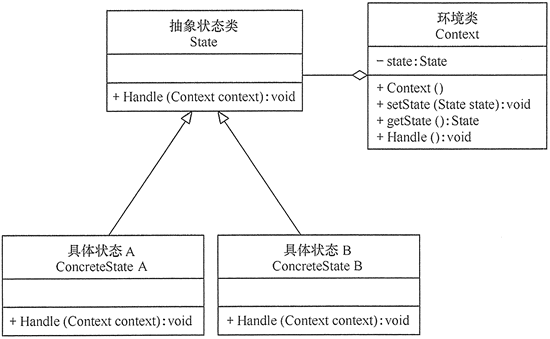

# 状态模式

状态模式的结构与实现
----------

状态模式把受环境改变的对象行为包装在不同的状态对象里，其意图是让一个对象在其内部状态改变的时候，其行为也随之改变。现在我们来分析其基本结构和实现方法。

#### 1\. 模式的结构

状态模式包含以下主要角色。

1. 环境（Context）角色：也称为上下文，它定义了客户感兴趣的接口，维护一个当前状态，并将与状态相关的操作委托给当前状态对象来处理。
2. 抽象状态（State）角色：定义一个接口，用以封装环境对象中的特定状态所对应的行为。
3. 具体状态（Concrete State）角色：实现抽象状态所对应的行为。

其结构图如图 1 所示。

图1 状态模式的结构图

#### 2\. 模式的实现

状态模式的实现代码如state.go所示。