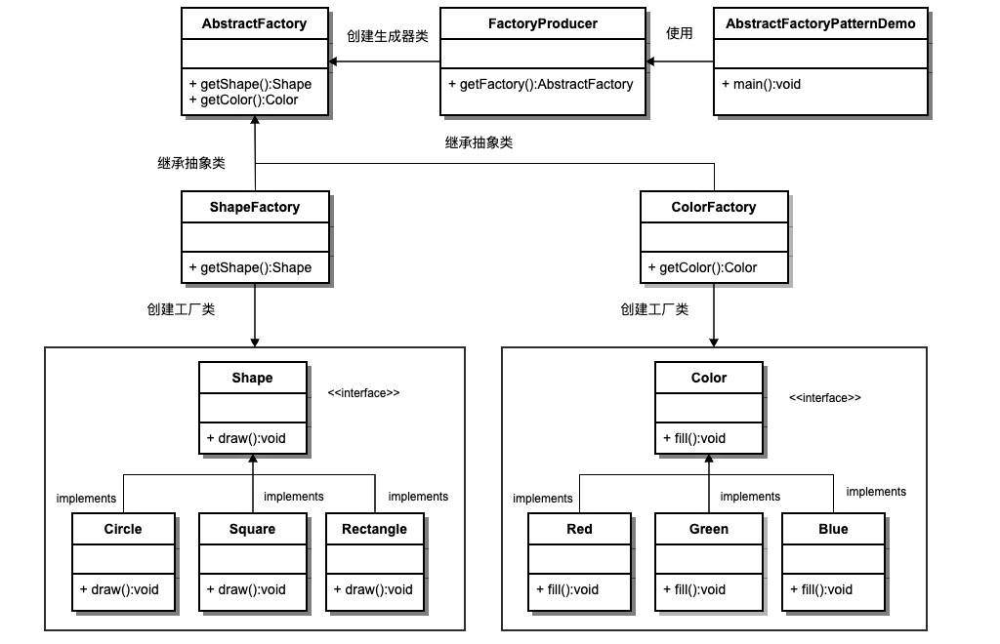
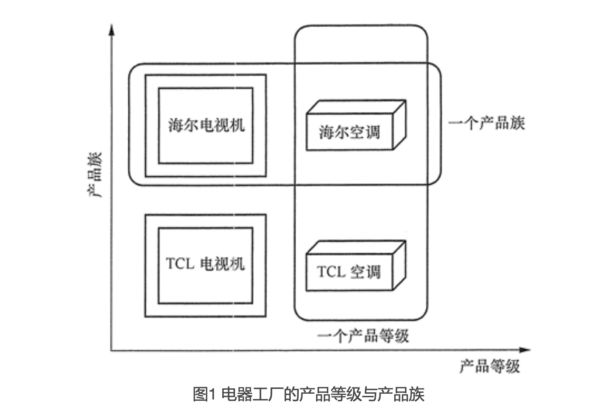
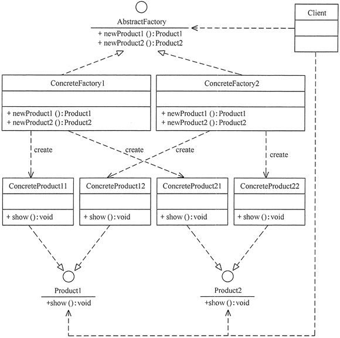
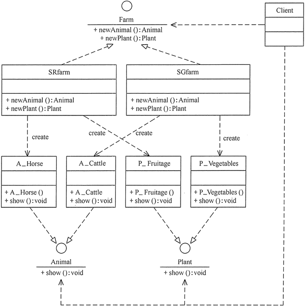
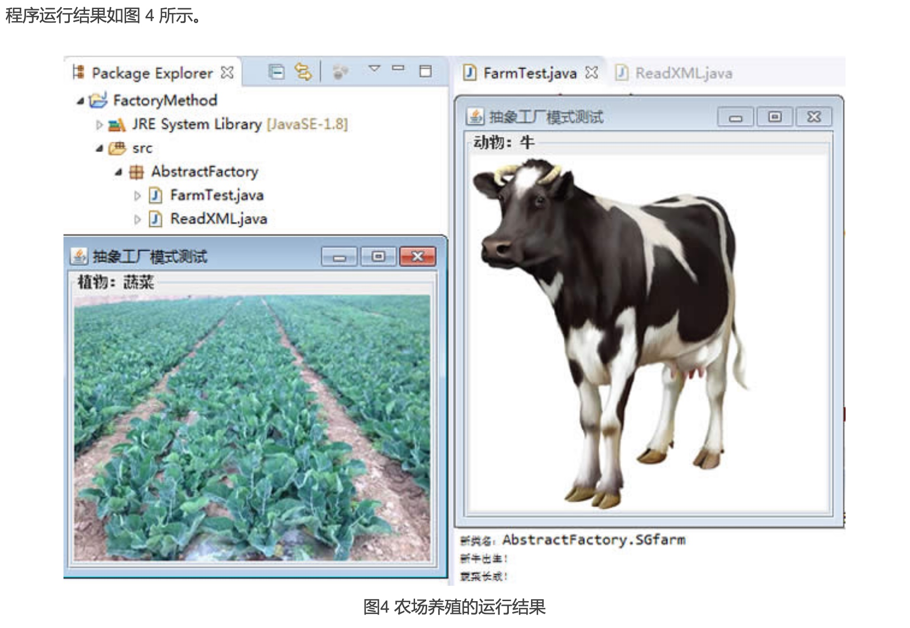

# 对象创建型-抽象工厂模式 Abstract Factory Pattern

围绕一个超级工厂创建其他工厂，属于创建型模式。

抽象工厂模式中，接口是负责创建一个相关对象的工厂，不需要显式指定他们的类。每个生成的工厂都能按照工厂模式提供对象。

意图：提供一个创建一系列相关或相互依赖对象的接口，而无需指定他们具体的类。

解决：接口选择的问题。

何时使用：系统的产品有多于一个的产品族，而系统只消费其中某一族的产品。

如何解决：在一个产品族里，定义多个产品。

关键代码：在一个工厂里聚合多个同类产品。

应用实例：一个衣柜里有不同款式不同颜色的衣服。

优点：当一个产品族中的多个对象被设计成一起工作时，它能保证客户端始终只使用同一个产品族的对象。

缺点：产品族扩展非常困难，要增加一个系列的某一个产品时，即要在抽象的creator里加代码，也要在具体的实现里加代码。

使用场景：1.QQ换肤，一整套一起换 2.生成不同操作系统的程序



前面介绍的[工厂方法模式](http://c.biancheng.net/view/1348.html)中考虑的是一类产品的生产，如畜牧场只养动物、电视机厂只生产电视机、计算机软件学院只培养计算机软件专业的学生等。

同种类称为同等级，也就是说：[工厂方法模式](http://c.biancheng.net/view/1348.html)只考虑生产同等级的产品，但是在现实生活中许多工厂是综合型的工厂，能生产多等级（种类） 的产品，如农场里既养动物又种植物，电器厂既生产电视机又生产洗衣机或空调，大学既有软件专业又有生物专业等。

本节要介绍的抽象工厂模式将考虑多等级产品的生产，将同一个具体工厂所生产的位于不同等级的一组产品称为一个产品族，图 1 所示的是海尔工厂和 TCL 工厂所生产的电视机与空调对应的关系图。



模式的定义与特点
--------

抽象工厂（AbstractFactory）模式的定义：是一种为访问类提供一个创建一组相关或相互依赖对象的接口，且访问类无须指定所要产品的具体类就能得到同族的不同等级的产品的模式结构。

抽象工厂模式是工厂方法模式的升级版本，工厂方法模式只生产一个等级的产品，而抽象工厂模式可生产多个等级的产品。

使用抽象工厂模式一般要满足以下条件。

* 系统中有多个产品族，每个具体工厂创建同一族但属于不同等级结构的产品。
* 系统一次只可能消费其中某一族产品，即同族的产品一起使用。

抽象工厂模式除了具有工厂方法模式的优点外，其他主要优点如下。

* 可以在类的内部对产品族中相关联的多等级产品共同管理，而不必专门引入多个新的类来进行管理。
* 当需要产品族时，抽象工厂可以保证客户端始终只使用同一个产品的产品组。
* 抽象工厂增强了程序的可扩展性，当增加一个新的产品族时，不需要修改原代码，满足开闭原则。

其缺点是：当产品族中需要增加一个新的产品时，所有的工厂类都需要进行修改。增加了系统的抽象性和理解难度。

模式的结构与实现
--------

抽象工厂模式同工厂方法模式一样，也是由抽象工厂、具体工厂、抽象产品和具体产品等 4 个要素构成，但抽象工厂中方法个数不同，抽象产品的个数也不同。现在我们来分析其基本结构和实现方法。

#### 1\. 模式的结构

抽象工厂模式的主要角色如下。

1. 抽象工厂（Abstract Factory）：提供了创建产品的接口，它包含多个创建产品的方法 newProduct()，可以创建多个不同等级的产品。
2. 具体工厂（Concrete Factory）：主要是实现抽象工厂中的多个抽象方法，完成具体产品的创建。
3. 抽象产品（Product）：定义了产品的规范，描述了产品的主要特性和功能，抽象工厂模式有多个抽象产品。
4. 具体产品（ConcreteProduct）：实现了抽象产品角色所定义的接口，由具体工厂来创建，它同具体工厂之间是多对一的关系。

抽象工厂模式的结构图如图 2 所示。



#### 2\. 模式的实现

从图 2 可以看出抽象工厂模式的结构同工厂方法模式的结构相似，不同的是其产品的种类不止一个，所以创建产品的方法也不止一个。下面给出抽象工厂和具体工厂的代码。

(1) 抽象工厂：提供了产品的生成方法。

```sh
interface AbstractFactory {
    public Product1 newProduct1();
    public Product2 newProduct2();
}
```

(2) 具体工厂：实现了产品的生成方法。

```sh
class ConcreteFactory1 implements AbstractFactory {
    public Product1 newProduct1() {
        System.out.println("具体工厂 1 生成-->具体产品 11...");
        return new ConcreteProduct11();
    }
    public Product2 newProduct2() {
        System.out.println("具体工厂 1 生成-->具体产品 21...");
        return new ConcreteProduct21();
    }
}
```

模式的应用实例
-------

【例1】用抽象工厂模式设计农场类。

分析：农场中除了像畜牧场一样可以养动物，还可以培养植物，如养马、养牛、种菜、种水果等，所以本实例比前面介绍的畜牧场类复杂，必须用抽象工厂模式来实现。

本例用抽象工厂模式来设计两个农场，一个是韶关农场用于养牛和种菜，一个是上饶农场用于养马和种水果，可以在以上两个农场中定义一个生成动物的方法 newAnimal() 和一个培养植物的方法 newPlant()。

对马类、牛类、蔬菜类和水果类等具体产品类，由于要显示它们的图像（[点此下载图片](http://c.biancheng.net/uploads/soft/181113/3-1Q114160J0.zip)），所以它们的构造函数中用到了 JPanel、JLabel 和 ImageIcon 等组件，并定义一个 show() 方法来显示它们。

客户端程序通过对象生成器类 ReadXML 读取 XML 配置文件中的数据来决定养什么动物和培养什么植物（[点此下载 XML 文件](http://c.biancheng.net/uploads/soft/181113/3-1Q114160S7.zip)）。其结构图如图 3 所示。



```sh
package AbstractFactory;

import java.awt.*;
import javax.swing.*;

public class FarmTest {
    public static void main(String[] args) {
        try {
            Farm f;
            Animal a;
            Plant p;
            f = (Farm) ReadXML.getObject();
            a = f.newAnimal();
            p = f.newPlant();
            a.show();
            p.show();
        } catch (Exception e) {
            System.out.println(e.getMessage());
        }
    }
}

//抽象产品：动物类
interface Animal {
    public void show();
}

//具体产品：马类
class Horse implements Animal {
    JScrollPane sp;
    JFrame jf = new JFrame("抽象工厂模式测试");

    public Horse() {
        Container contentPane = jf.getContentPane();
        JPanel p1 = new JPanel();
        p1.setLayout(new GridLayout(1, 1));
        p1.setBorder(BorderFactory.createTitledBorder("动物：马"));
        sp = new JScrollPane(p1);
        contentPane.add(sp, BorderLayout.CENTER);
        JLabel l1 = new JLabel(new ImageIcon("src/A_Horse.jpg"));
        p1.add(l1);
        jf.pack();
        jf.setVisible(false);
        jf.setDefaultCloseOperation(JFrame.EXIT_ON_CLOSE);//用户点击窗口关闭
    }

    public void show() {
        jf.setVisible(true);
    }
}

//具体产品：牛类
class Cattle implements Animal {
    JScrollPane sp;
    JFrame jf = new JFrame("抽象工厂模式测试");

    public Cattle() {
        Container contentPane = jf.getContentPane();
        JPanel p1 = new JPanel();
        p1.setLayout(new GridLayout(1, 1));
        p1.setBorder(BorderFactory.createTitledBorder("动物：牛"));
        sp = new JScrollPane(p1);
        contentPane.add(sp, BorderLayout.CENTER);
        JLabel l1 = new JLabel(new ImageIcon("src/A_Cattle.jpg"));
        p1.add(l1);
        jf.pack();
        jf.setVisible(false);
        jf.setDefaultCloseOperation(JFrame.EXIT_ON_CLOSE);//用户点击窗口关闭
    }

    public void show() {
        jf.setVisible(true);
    }
}

//抽象产品：植物类
interface Plant {
    public void show();
}

//具体产品：水果类
class Fruitage implements Plant {
    JScrollPane sp;
    JFrame jf = new JFrame("抽象工厂模式测试");

    public Fruitage() {
        Container contentPane = jf.getContentPane();
        JPanel p1 = new JPanel();
        p1.setLayout(new GridLayout(1, 1));
        p1.setBorder(BorderFactory.createTitledBorder("植物：水果"));
        sp = new JScrollPane(p1);
        contentPane.add(sp, BorderLayout.CENTER);
        JLabel l1 = new JLabel(new ImageIcon("src/P_Fruitage.jpg"));
        p1.add(l1);
        jf.pack();
        jf.setVisible(false);
        jf.setDefaultCloseOperation(JFrame.EXIT_ON_CLOSE);//用户点击窗口关闭
    }

    public void show() {
        jf.setVisible(true);
    }
}

//具体产品：蔬菜类
class Vegetables implements Plant {
    JScrollPane sp;
    JFrame jf = new JFrame("抽象工厂模式测试");

    public Vegetables() {
        Container contentPane = jf.getContentPane();
        JPanel p1 = new JPanel();
        p1.setLayout(new GridLayout(1, 1));
        p1.setBorder(BorderFactory.createTitledBorder("植物：蔬菜"));
        sp = new JScrollPane(p1);
        contentPane.add(sp, BorderLayout.CENTER);
        JLabel l1 = new JLabel(new ImageIcon("src/P_Vegetables.jpg"));
        p1.add(l1);
        jf.pack();
        jf.setVisible(false);
        jf.setDefaultCloseOperation(JFrame.EXIT_ON_CLOSE);//用户点击窗口关闭
    }

    public void show() {
        jf.setVisible(true);
    }
}

//抽象工厂：农场类
interface Farm {
    public Animal newAnimal();

    public Plant newPlant();
}

//具体工厂：韶关农场类
class SGfarm implements Farm {
    public Animal newAnimal() {
        System.out.println("新牛出生！");
        return new Cattle();
    }

    public Plant newPlant() {
        System.out.println("蔬菜长成！");
        return new Vegetables();
    }
}

//具体工厂：上饶农场类
class SRfarm implements Farm {
    public Animal newAnimal() {
        System.out.println("新马出生！");
        return new Horse();
    }

    public Plant newPlant() {
        System.out.println("水果长成！");
        return new Fruitage();
    }
}
```

```sh
package AbstractFactory;
import javax.xml.parsers.*;
import org.w3c.dom.*;
import java.io.*;

class ReadXML {
    public static Object getObject() {
        try {
            DocumentBuilderFactory dFactory = DocumentBuilderFactory.newInstance();
            DocumentBuilder builder = dFactory.newDocumentBuilder();
            Document doc;
            doc = builder.parse(new File("src/AbstractFactory/config.xml"));
            NodeList nl = doc.getElementsByTagName("className");
            Node classNode = nl.item(0).getFirstChild();
            String cName = "AbstractFactory." + classNode.getNodeValue();
            System.out.println("新类名：" + cName);
            Class<?> c = Class.forName(cName);
            Object obj = c.newInstance();
            return obj;
        } catch (Exception e) {
            e.printStackTrace();
            return null;
        }
    }
}
```



模式的应用场景
-------

抽象工厂模式最早的应用是用于创建属于不同操作系统的视窗构件。如 [Java](http://c.biancheng.net/java/) 的 AWT 中的 Button 和 Text 等构件在 Windows 和 UNIX 中的本地实现是不同的。

抽象工厂模式通常适用于以下场景：

1. 当需要创建的对象是一系列相互关联或相互依赖的产品族时，如电器工厂中的电视机、洗衣机、空调等。
2. 系统中有多个产品族，但每次只使用其中的某一族产品。如有人只喜欢穿某一个品牌的衣服和鞋。
3. 系统中提供了产品的类库，且所有产品的接口相同，客户端不依赖产品实例的创建细节和内部结构。

模式的扩展
-----

抽象工厂模式的扩展有一定的“开闭原则”倾斜性：

1. 当增加一个新的产品族时只需增加一个新的具体工厂，不需要修改原代码，满足开闭原则。
2. 当产品族中需要增加一个新种类的产品时，则所有的工厂类都需要进行修改，不满足开闭原则。

另一方面，当系统中只存在一个等级结构的产品时，抽象工厂模式将退化到工厂方法模式。