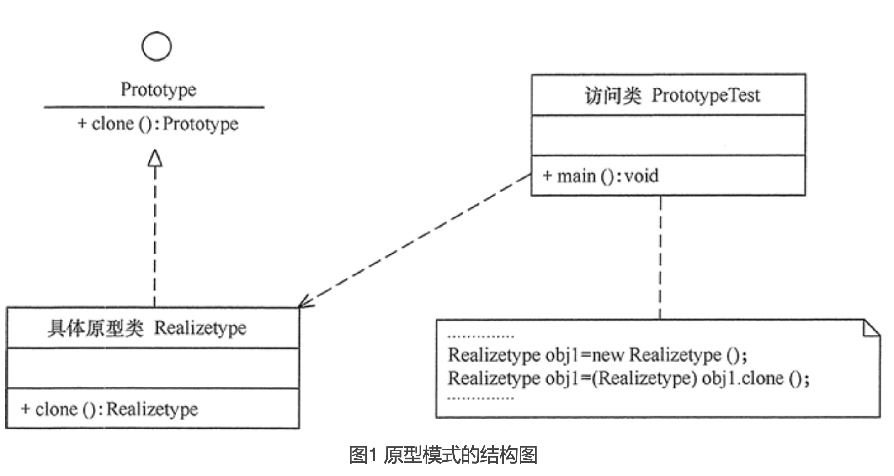
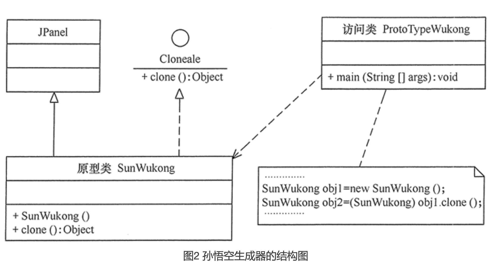

# 原型模式

原型模式的定义与特点
----------

原型（Prototype）模式的定义如下：用一个已经创建的实例作为原型，通过复制该原型对象来创建一个和原型相同或相似的新对象。在这里，原型实例指定了要创建的对象的种类。用这种方式创建对象非常高效，根本无须知道对象创建的细节。例如，Windows 操作系统的安装通常较耗时，如果复制就快了很多。在生活中复制的例子非常多，这里不一一列举了。

#### 原型模式的优点：

* Java 自带的原型模式基于内存二进制流的复制，在性能上比直接 new 一个对象更加优良。
* 可以使用深克隆方式保存对象的状态，使用原型模式将对象复制一份，并将其状态保存起来，简化了创建对象的过程，以便在需要的时候使用（例如恢复到历史某一状态），可辅助实现撤销操作。

#### 原型模式的缺点：

* 需要为每一个类都配置一个 clone 方法
* clone 方法位于类的内部，当对已有类进行改造的时候，需要修改代码，违背了开闭原则。
* 当实现深克隆时，需要编写较为复杂的代码，而且当对象之间存在多重嵌套引用时，为了实现深克隆，每一层对象对应的类都必须支持深克隆，实现起来会比较麻烦。因此，深克隆、浅克隆需要运用得当。

原型模式的结构与实现
----------

由于 Java 提供了对象的 clone() 方法，所以用 Java 实现原型模式很简单。

#### 1\. 模式的结构

原型模式包含以下主要角色。

1. 抽象原型类：规定了具体原型对象必须实现的接口。
2. 具体原型类：实现抽象原型类的 clone() 方法，它是可被复制的对象。
3. 访问类：使用具体原型类中的 clone() 方法来复制新的对象。

其结构图如图 1 所示。

原型模式的应用实例
---------

【例】用原型模式模拟“孙悟空”复制自己。

分析：孙悟空拔下猴毛轻轻一吹就变出很多孙悟空，这实际上是用到了原型模式。这里的孙悟空类 SunWukong 是具体原型类，而 Cloneable 接口是抽象原型类。代码示例：prototype.go

