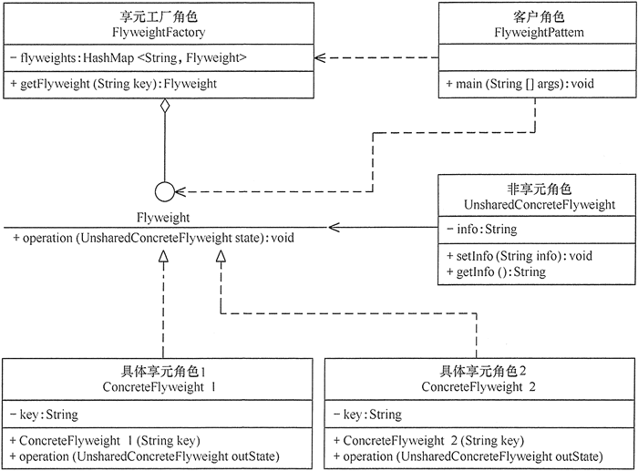

# 享元模式

享元模式的定义与特点
----------

享元（Flyweight）模式的定义：运用共享技术来有效地支持大量细粒度对象的复用。它通过共享已经存在的对象来大幅度减少需要创建的对象数量、避免大量相似类的开销，从而提高系统资源的利用率。

享元模式的主要优点是：相同对象只要保存一份，这降低了系统中对象的数量，从而降低了系统中细粒度对象给内存带来的压力。

其主要缺点是：

1. 为了使对象可以共享，需要将一些不能共享的状态外部化，这将增加程序的复杂性。
2. 读取享元模式的外部状态会使得运行时间稍微变长。

享元模式的结构与实现
----------

享元模式中存在以下两种状态：

1. 内部状态，即不会随着环境的改变而改变的可共享部分；
2. 外部状态，指随环境改变而改变的不可以共享的部分。享元模式的实现要领就是区分应用中的这两种状态，并将外部状态外部化。下面来分析其基本结构和实现方法。

#### 1\. 模式的结构

享元模式的主要角色有如下。

1. 抽象享元角色（Flyweight）:是所有的具体享元类的基类，为具体享元规范需要实现的公共接口，非享元的外部状态以参数的形式通过方法传入。
2. 具体享元（Concrete Flyweight）角色：实现抽象享元角色中所规定的接口。
3. 非享元（Unsharable Flyweight)角色：是不可以共享的外部状态，它以参数的形式注入具体享元的相关方法中。
4. 享元工厂（Flyweight Factory）角色：负责创建和管理享元角色。当客户对象请求一个享元对象时，享元工厂检査系统中是否存在符合要求的享元对象，如果存在则提供给客户；如果不存在的话，则创建一个新的享元对象。

图 1 是享元模式的结构图。图中的 UnsharedConcreteFlyweight 是非享元角色，里面包含了非共享的外部状态信息 info；而 Flyweight 是抽象享元角色，里面包含了享元方法 operation(UnsharedConcreteFlyweight state)，非享元的外部状态以参数的形式通过该方法传入；ConcreteFlyweight 是具体享元角色，包含了关键字 key，它实现了抽象享元接口；FlyweightFactory 是享元工厂角色，它逝关键字 key 来管理具体享元；客户角色通过享元工厂获取具体享元，并访问具体享元的相关方法。

图1 享元模式的结构图

#### 2\. 模式的实现

享元模式的实现代码如flyweight.go所示。